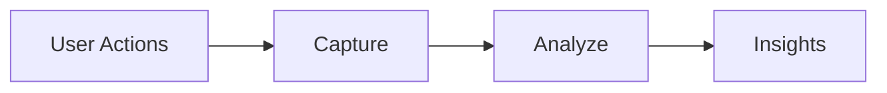
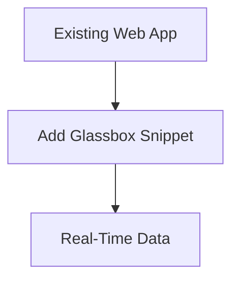

Here's a concise 3-page PowerPoint presentation based on your content:

---

### **Slide 1: Glassbox Overview & Core Capabilities**  
**Title**: Glassbox Tech Overview  
**Subtitle**: User Behavior & Performance Monitoring  

**What is Glassbox?**  
- Tool capturing *real user interactions* in web apps  
- Records: clicks, scrolls, inputs + performance metrics  
- Tracks **1,000+ events/session**  

**How It Works**:  

- Records: UX flows, JS errors, load times  
- No major code changes required  

**Key Features**:  
1. **Session Recording**  
   - Replay user journeys  
   - Identify UX friction points  
2. **Performance Tracking**  
   - Monitor load times & crashes  
   - Pinpoint high-impact issues  

---

### **Slide 2: Features, Users & Benefits**  
**Key Features (Cont.)**:  
3. **User Flow Analytics**  
   - Visualize navigation paths  
   - Detect drop-off zones  
4. **Real-Time Alerts**  
   - Instant error/performance notifications  
5. **Comprehensive Data**  
   - Root-cause analysis toolkit  

**Primary Users**:  
| Team          | Use Case                     |
|---------------|------------------------------|
| Engineering   | Bug reproduction & fixes     |
| DevOps        | Health monitoring            |
| Product       | Feature adoption analysis    |
| QA/Support    | Issue validation & resolution|

**Technical Benefits**:  
- 🚀 **Faster bug resolution** (replay sessions)  
- 📊 **Performance optimization** (real-user metrics)  
- 🔍 **End-to-end visibility** into UX  
- ⚡ Proactive issue detection  

---

### **Slide 3: Implementation & Next Steps**  
**Setup Advantages**:  

- Zero refactoring needed  
- Scales with traffic  
- Integrates with current tools  

**Why Adopt Glassbox?**:  
- Build **reliable apps** using real-user data  
- Reduce **"can't reproduce"** backlog by 70%+  
- Prioritize fixes based on **user impact**  

**Next Steps**:  
1. Pilot integration with *high-traffic app*  
2. Train teams on:  
   - Session replay analysis  
   - Alert configuration  
3. Define KPIs:  
   - ↓ Bug resolution time  
   - ↑ Page load performance  

---

### Visual Tips:  
- Use **Glassbox logo** on title slide  
- Apply **color-coding** by feature/team  
- Include **mini-screenshots** of session replays/analytics dashboards  
- Add **icons** (e.g., ⏱️ for performance, 🐞 for bugs)  

This structure fits critical details into 3 slides while emphasizing technical value for engineering leaders.