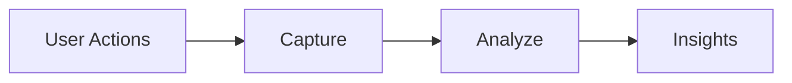
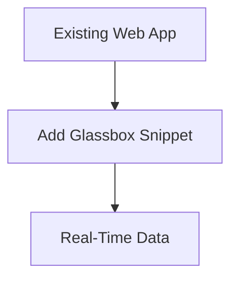

Here's a concise 3-page PowerPoint presentation based on your content:

---

### **Slide 1: Glassbox Overview & Core Capabilities**  
**Title**: Glassbox Tech Overview  
**Subtitle**: User Behavior & Performance Monitoring  

**What is Glassbox?**  
- Tool capturing *real user interactions* in web apps  
- Records: clicks, scrolls, inputs + performance metrics  
- Tracks **1,000+ events/session**  

**How It Works**:  

- Records: UX flows, JS errors, load times  
- No major code changes required  

**Key Features**:  
1. **Session Recording**  
   - Replay user journeys  
   - Identify UX friction points  
2. **Performance Tracking**  
   - Monitor load times & crashes  
   - Pinpoint high-impact issues  

---

### **Slide 2: Features, Users & Benefits**  
**Key Features (Cont.)**:  
3. **User Flow Analytics**  
   - Visualize navigation paths  
   - Detect drop-off zones  
4. **Real-Time Alerts**  
   - Instant error/performance notifications  
5. **Comprehensive Data**  
   - Root-cause analysis toolkit  

**Primary Users**:  
| Team          | Use Case                     |
|---------------|------------------------------|
| Engineering   | Bug reproduction & fixes     |
| DevOps        | Health monitoring            |
| Product       | Feature adoption analysis    |
| QA/Support    | Issue validation & resolution|

**Technical Benefits**:  
- 🚀 **Faster bug resolution** (replay sessions)  
- 📊 **Performance optimization** (real-user metrics)  
- 🔍 **End-to-end visibility** into UX  
- ⚡ Proactive issue detection  

---

### **Slide 3: Implementation & Next Steps**  
**Setup Advantages**:  

- Zero refactoring needed  
- Scales with traffic  
- Integrates with current tools  

**Why Adopt Glassbox?**:  
- Build **reliable apps** using real-user data  
- Reduce **"can't reproduce"** backlog by 70%+  
- Prioritize fixes based on **user impact**  

**Next Steps**:  
1. Pilot integration with *high-traffic app*  
2. Train teams on:  
   - Session replay analysis  
   - Alert configuration  
3. Define KPIs:  
   - ↓ Bug resolution time  
   - ↑ Page load performance  

---

### Visual Tips:  
- Use **Glassbox logo** on title slide  
- Apply **color-coding** by feature/team  
- Include **mini-screenshots** of session replays/analytics dashboards  
- Add **icons** (e.g., ⏱️ for performance, 🐞 for bugs)  

This structure fits critical details into 3 slides while emphasizing technical value for engineering leaders.

// types/api.ts
export interface ApiResponse < T = any > {
    data: T;
    message ? : string;
    success: boolean;
}

export interface ApiError {
    message: string;
    status: number;
    code ? : string;
}

export interface PaginatedResponse < T > {
    data: T[];
    total: number;
    page: number;
    limit: number;
    totalPages: number;
}

export interface QueryParams {
    [key: string]: string | number | boolean | undefined;
}

// config/api.ts
import axios, {
    AxiosInstance,
    AxiosRequestConfig,
    AxiosResponse
} from‘ axios’;

class ApiClient {
    private client: AxiosInstance;

    constructor(baseURL: string = process.env.REACT_APP_API_URL || ‘http: //localhost:3001/api’) {
        this.client = axios.create({
            baseURL,
            timeout: 10000,
            headers: {
                ‘
                Content - Type’: ‘application / json’,
            },
        });

        ``
        `
this.setupInterceptors();
`
        ``

    }

    private setupInterceptors() {
        // Request interceptor
        this.client.interceptors.request.use(
            (config) => {
                // Add auth token if available
                const token = localStorage.getItem(‘authToken’);
                if (token) {
                    config.headers.Authorization = `Bearer ${token}`;
                }
                return config;
            },
            (error) => Promise.reject(error)
        );

        ``
        `
// Response interceptor
this.client.interceptors.response.use(
  (response: AxiosResponse) => response,
  (error) => {
    // Handle common errors
    if (error.response?.status === 401) {
      // Handle unauthorized access
      localStorage.removeItem('authToken');
      window.location.href = '/login';
    }
    
    const apiError: ApiError = {
      message: error.response?.data?.message || error.message || 'An error occurred',
      status: error.response?.status || 500,
      code: error.response?.data?.code,
    };
    
    return Promise.reject(apiError);
  }
);
`
        ``

    }

    // Generic GET method
    async get < T > (url: string, params ? : QueryParams, config ? : AxiosRequestConfig): Promise < T > {
        const response = await this.client.get < T > (url, {
            params,
            …config
        });
        return response.data;
    }

    // Generic POST method
    async post < T, D = any > (url: string, data ? : D, config ? : AxiosRequestConfig): Promise < T > {
        const response = await this.client.post < T > (url, data, config);
        return response.data;
    }

    // Generic PUT method
    async put < T, D = any > (url: string, data ? : D, config ? : AxiosRequestConfig): Promise < T > {
        const response = await this.client.put < T > (url, data, config);
        return response.data;
    }

    // Generic PATCH method
    async patch < T, D = any > (url: string, data ? : D, config ? : AxiosRequestConfig): Promise < T > {
        const response = await this.client.patch < T > (url, data, config);
        return response.data;
    }

    // Generic DELETE method
    async delete < T > (url: string, config ? : AxiosRequestConfig): Promise < T > {
        const response = await this.client.delete < T > (url, config);
        return response.data;
    }

    // Set auth token
    setAuthToken(token: string) {
        localStorage.setItem(‘authToken’, token);
        this.client.defaults.headers.Authorization = `Bearer ${token}`;
    }

    // Clear auth token
    clearAuthToken() {
        localStorage.removeItem(‘authToken’);
        delete this.client.defaults.headers.Authorization;
    }
}

export const apiClient = new ApiClient();

// hooks/useApi.ts
import {
    useQuery,
    useMutation,
    useQueryClient,
    UseQueryOptions,
    UseMutationOptions
} from‘ @tanstack / react - query’;
import {
    apiClient
} from‘.. / config / api’;
import {
    ApiError,
    QueryParams
} from‘.. / types / api’;

// Generic GET hook
export function useApiQuery < T > (
    queryKey: (string | number)[],
    url: string,
    params ? : QueryParams,
    options ? : Omit < UseQueryOptions < T, ApiError > , ‘queryKey’ | ‘queryFn’ >
) {
    return useQuery < T, ApiError > ({
        queryKey: […queryKey, params],
        queryFn: () => apiClient.get < T > (url, params),
        …options,
    });
}

// Generic POST mutation hook
export function useApiMutation < TData, TVariables = any > (
    url: string,
    options ? : UseMutationOptions < TData, ApiError, TVariables >
) {
    const queryClient = useQueryClient();

    return useMutation < TData, ApiError, TVariables > ({
        mutationFn: (variables: TVariables) => apiClient.post < TData,
        TVariables > (url, variables),
        onSuccess: (data, variables, context) => {
            // Invalidate and refetch queries after successful mutation
            queryClient.invalidateQueries();
            options?.onSuccess?.(data, variables, context);
        },
        …options,
    });
}

// Generic PUT mutation hook
export function useApiUpdateMutation < TData, TVariables = any > (
    url: string,
    options ? : UseMutationOptions < TData, ApiError, TVariables >
) {
    const queryClient = useQueryClient();

    return useMutation < TData, ApiError, TVariables > ({
        mutationFn: (variables: TVariables) => apiClient.put < TData,
        TVariables > (url, variables),
        onSuccess: (data, variables, context) => {
            queryClient.invalidateQueries();
            options?.onSuccess?.(data, variables, context);
        },
        …options,
    });
}

// Generic DELETE mutation hook
export function useApiDeleteMutation < TData = any > (
    url: string,
    options ? : UseMutationOptions < TData, ApiError, void >
) {
    const queryClient = useQueryClient();

    return useMutation < TData, ApiError, void > ({
        mutationFn: () => apiClient.delete < TData > (url),
        onSuccess: (data, variables, context) => {
            queryClient.invalidateQueries();
            options?.onSuccess?.(data, variables, context);
        },
        …options,
    });
}

// Custom hook for paginated queries
export function usePaginatedQuery < T > (
    queryKey: (string | number)[],
    url: string,
    page: number = 1,
    limit: number = 10,
    additionalParams ? : QueryParams,
    options ? : Omit < UseQueryOptions < T, ApiError > , ‘queryKey’ | ‘queryFn’ >
) {
    const params = {
        page,
        limit,
        …additionalParams
    };

    return useQuery < T, ApiError > ({
        queryKey: […queryKey, params],
        queryFn: () => apiClient.get < T > (url, params),
        keepPreviousData: true,
        …options,
    });
}

// services/example.ts - Example service implementation
export interface User {
    id: number;
    name: string;
    email: string;
    createdAt: string;
}

export interface CreateUserData {
    name: string;
    email: string;
}

export interface UpdateUserData {
    name ? : string;
    email ? : string;
}

// Example service using the generic hooks
export const userService = {
        // Get all users
        useUsers: (params ? : QueryParams) =>
            useApiQuery < ApiResponse < User[] >> ([‘users’], ‘/users’, params),

                // Get user by ID
                useUser: (id: number) =>
                useApiQuery < ApiResponse < User >> ([‘users’, id], `/users/${id}`, undefined, {
                    enabled: !!id,
                }),

                // Create user
                useCreateUser: () =>
                useApiMutation < ApiResponse < User > , CreateUserData > (’/users’),

                    // Update user
                    useUpdateUser: (id: number) =>
                    useApiUpdateMutation < ApiResponse < User > , UpdateUserData > (`/users/${id}`),

                    // Delete user
                    useDeleteUser: (id: number) =>
                    useApiDeleteMutation < ApiResponse < void >> (`/users/${id}`),

                    // Paginated users
                    usePaginatedUsers: (page: number = 1, limit: number = 10, search ? : string) =>
                    usePaginatedQuery < ApiResponse < PaginatedResponse < User >>> (
                        [‘users’, ‘paginated’], ‘/users’,
                        page,
                        limit,
                        search ? {
                            search
                        } : undefined
                    ),
                };

                // App.tsx - Setup example
                import React from‘ react’;
                import {
                    QueryClient,
                    QueryClientProvider
                } from‘ @tanstack / react - query’;
                import {
                    ReactQueryDevtools
                } from‘ @tanstack / react - query - devtools’;

                const queryClient = new QueryClient({
                    defaultOptions: {
                        queries: {
                            retry: 3,
                            staleTime: 5 * 60 * 1000, // 5 minutes
                            cacheTime: 10 * 60 * 1000, // 10 minutes
                            refetchOnWindowFocus: false,
                        },
                        mutations: {
                            retry: 1,
                        },
                    },
                });

                function App() {
                    return ( <
                        QueryClientProvider client = {
                            queryClient
                        } > {
                            /* Your app components */ } <
                        ReactQueryDevtools initialIsOpen = {
                            false
                        }
                        /> <
                        /QueryClientProvider>
                    );
                }

                export default App;

                // components/UserList.tsx - Usage example
                import React, {
                    useState
                } from‘ react’;
                import {
                    userService
                } from‘.. / services / example’;

                const UserList: React.FC = () => {
                    const [page, setPage] = useState(1);
                    const [search, setSearch] = useState(’’);

                    const {
                        data: users,
                        isLoading,
                        error
                    } = userService.usePaginatedUsers(page, 10, search);
                    const createUserMutation = userService.useCreateUser();
                    const deleteUserMutation = userService.useDeleteUser(0); // ID will be passed in mutate

                    const handleCreateUser = async () => {
                        try {
                            await createUserMutation.mutateAsync({
                                name: ‘New User’,
                                email: ‘user @example.com’,
                            });
                        } catch (error) {
                            console.error(‘Failed to create user: ’, error);
                        }
                    };

                    const handleDeleteUser = async (id: number) => {
                        try {
                            await deleteUserMutation.mutateAsync();
                        } catch (error) {
                            console.error(‘Failed to delete user: ’, error);
                        }
                    };

                    if (isLoading) return < div > Loading… < /div>;
                    if (error) return < div > Error: {
                        error.message
                    } < /div>;

                    return ( <
                        div >
                        <
                        input type = “text” placeholder = “Search users…” value = {
                            search
                        }
                        onChange = {
                            (e) => setSearch(e.target.value)
                        }
                        />

                        ``
                        `
  <button onClick={handleCreateUser} disabled={createUserMutation.isLoading}>
    {createUserMutation.isLoading ? 'Creating...' : 'Create User'}
  </button>

  {users?.data.data.map((user) => (
    

      <h3>{user.name}</h3>
      
{user.email}

      <button 
        onClick={() => handleDeleteUser(user.id)}
        disabled={deleteUserMutation.isLoading}
      >
        Delete
      </button>
    

  ))}

  

    <button 
      onClick={() => setPage(p => Math.max(1, p - 1))}
      disabled={page === 1}
    >
      Previous
    </button>
    Page {page}
    <button 
      onClick={() => setPage(p => p + 1)}
      disabled={!users?.data.data.length}
    >
      Next
    </button>
  

`
                        ``

                    );
                };

                export default UserList;